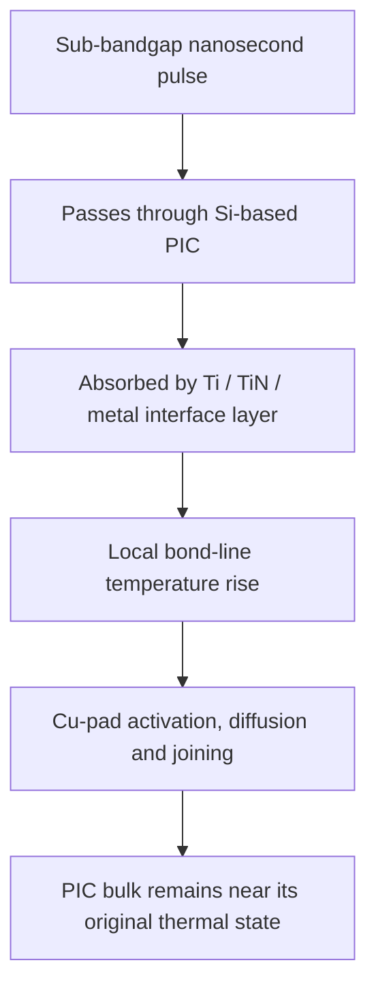

# Cools CPO Zero-Thermal-Budget Bonding

## Bond the EIC to the PIC without heating the photonic device body

> **Conventional bonding heats the photonic IC and corrects the resulting wavelength drift afterward.**  
> **Cools selectively heats only the metal bond interface so that the drift is prevented at its source.**

[한국어](README_KR.md) · [中文](README_ZH.md)

## Core proposition

Co-Packaged Optics (CPO) places a photonic integrated circuit (PIC) next to an electronic integrated circuit (EIC). The PIC contains optical functions such as modulators, detectors, resonators, waveguides, and lasers; the EIC contains drivers, transimpedance amplifiers, control circuits, and high-speed electrical interfaces.

The EIC–PIC joint is therefore not a conventional chip-to-chip bond. Heating the complete assembly during bonding can change the optical state of the PIC through thermo-optic index shift, residual stress, package strain, and wavelength displacement. Industry practice then compensates these effects with trimming, micro-heaters, thermoelectric coolers, calibration tables, or active control.

**Cools changes the sequence: do not heat the PIC and correct it later. Heat only the bond interface and preserve the original optical state.**

## The conventional thermal burden


A representative Cu–Cu or Cu-based hybrid-bond flow can require substantial thermal exposure of the bonded dies. For a photonic device, this means that the assembly process itself becomes a source of optical drift.

## Cools sub-bandgap bonding principle

A pulsed wavelength below the absorption edge of the semiconductor body is transmitted through the PIC with low bulk absorption. The optical energy is instead absorbed at a deliberately designed metal interface associated with the EIC–PIC bond pads.

For a silicon-based PIC optical path, a representative implementation uses a near-infrared nanosecond pulse in the approximately 1.5 µm class. The silicon body serves as the transmission window, while a thin interfacial metal, barrier, adhesion, passivation, or dedicated absorber layer converts the pulse into heat directly at the bond line.

Representative absorber functions may be implemented by materials or multilayers including:

- titanium (Ti) or titanium nitride (TiN) associated with a copper pad;
- chromium (Cr), nickel (Ni), tantalum (Ta), or related metal stacks;
- metal nitrides, metal oxides, or engineered nanolayers;
- a dedicated optical absorber positioned between, around, or beneath Cu pads; and
- a wavelength-selective multilayer designed for the selected pulse duration and fluence.

The public concept is not limited to one absorber material or one exact wavelength. The essential architecture is:

> **A semiconductor body that transmits the applied sub-bandgap pulse, combined with a bond-line structure that selectively absorbs that pulse and converts it into local joining heat.**

## Selective interface heating



A representative stack is:

```text
EIC — driver / TIA / control circuit
-----------------------------------
Cu pad and selective absorber / barrier / passivation interface
-----------------------------------
Cu pad
-----------------------------------
PIC — Si photonics / optical device layer

Sub-bandgap pulse enters through the PIC side,
passes through the semiconductor body,
and deposits energy only at the metal joining interface.
```

## Why nanosecond pulses matter

The objective is not merely to use a laser instead of a furnace. Pulse duration and energy localization change the thermal event itself.

- The interface reaches the temperature required for activation or metallurgical joining.
- The heated volume is restricted to the pad and nanoscale-to-microscale interfacial region.
- The short pulse limits lateral and vertical heat diffusion into the optical device body.
- Repetition, scan path, pulse overlap, and fluence can be matched to pad dimensions and interface thermal impedance.
- The bonding tool can address selected pad fields rather than heating the entire EIC–PIC assembly.

The resulting design target is a **large interface-temperature rise with a negligible PIC-body temperature rise**.

## From correction to prevention

```text
Conventional approach
Bond with global heat
→ shift the PIC optical state
→ measure the shift
→ compensate with heater / TEC / trimming / control

Cools approach
Transmit sub-bandgap pulse through the PIC
→ heat only the metal bond interface
→ join the EIC and PIC
→ preserve the pre-bond optical state
→ eliminate bonding-process-induced correction
```

This distinction is central.

Cools does not claim that every CPO system will never require any thermal control during operation. Lasers, resonators, modulators, and ASICs still generate operating heat. The claim is narrower and more valuable:

> **The bonding process itself need not create the wavelength drift, residual thermal damage, or calibration burden that must later be corrected.**

## Expected CPO advantages

| Item | Global thermal bonding | Cools sub-bandgap interface bonding |
|---|---|---|
| Heated region | EIC, PIC and surrounding stack | Metal bond line and pad vicinity |
| PIC-body temperature rise | Significant | Near-zero / negligible design target |
| Bonding-induced wavelength drift | Must be measured and compensated | Prevented at the source |
| Post-bond optical trimming | Frequently required | Bonding-induced trimming targeted for elimination |
| Micro-heater / TEC burden | Increased by assembly drift | Reserved for operating heat, not bonding damage |
| EIC–PIC alignment state | Exposed to global thermal expansion | Maintained under localized heating |
| Thermal budget | Wafer- or die-scale | Pad-selective |
| CPO scaling | Limited by optical sensitivity to assembly heat | Compatible with dense heterogeneous integration |

## Potential process sequence

1. Fabricate the PIC and EIC with aligned Cu or Cu-based bond pads.
2. Form or retain a wavelength-selective interfacial layer at the target joining surface.
3. Align and mechanically preload the EIC and PIC.
4. Deliver sub-bandgap nanosecond pulses through the transparent semiconductor side.
5. Selectively heat the metal interface while maintaining the PIC body near its initial temperature.
6. Activate, diffuse, soften, sinter, or metallurgically join the pad interface according to the selected stack.
7. Remove load after interfacial solidification or bond stabilization.
8. Verify electrical continuity, bond strength, optical wavelength, insertion loss, and resonance position without a post-bond thermal-recovery cycle.

## Applicable joining modes

The architecture can be developed for:

- Cu–Cu direct bonding;
- Cu with Ti, TiN, Ta, TaN, Cr, Ni, or related barrier/adhesion layers;
- metal-assisted hybrid bonding;
- micro-bump or low-volume solder-interface activation;
- metal nanoparticle or sinter interfaces;
- pad-selective thermocompression bonding;
- die-to-die, die-to-wafer, and wafer-to-wafer EIC–PIC integration; and
- silicon photonics, InP photonics, SiN photonics, and mixed-material optical engines where an appropriate transparent optical path and selective absorber can be designed.

## Validation program

The decisive test is not simply whether the pads bond. The technology must demonstrate that joining occurs while the optical body remains unchanged.

Recommended validation axes are:

1. **Interface temperature:** transient temperature or calibrated melt/phase indicator at the bond line.
2. **PIC-body temperature:** time-resolved measurement near resonators, modulators, or laser structures.
3. **Bond integrity:** shear, pull, daisy-chain resistance, void inspection, and thermal-cycle reliability.
4. **Optical preservation:** resonance wavelength, laser wavelength, insertion loss, extinction ratio, and detector response before and after bonding.
5. **Correction burden:** comparison of required trimming, heater power, TEC load, and calibration time.
6. **Selectivity:** ratio of interface energy deposition to semiconductor-body absorption.
7. **Scalability:** pad pitch, scan speed, pulse overlap, field size, and multi-die throughput.

The central qualification target is:

> **Electrical and mechanical bonding passes while the PIC optical transfer function remains within its pre-bond tolerance without a bonding-induced correction step.**

## Strategic meaning for CPO

CPO is commonly described as an optical-placement problem or an alignment problem. It is also a thermal-sequence problem.

The EIC must be placed close to the PIC for bandwidth and energy efficiency, but conventional joining heat can alter the optical device that the assembly is trying to integrate. Cools resolves this contradiction by separating the two events:

- the semiconductor body is used as an optical transmission path; and
- the metal interface alone is used as the thermal reaction zone.

This turns EIC–PIC assembly from a **global thermal process** into a **spectrally and spatially addressed interface process**.

## Core claim

> **A sub-bandgap nanosecond pulse passes through the photonic semiconductor body and selectively heats the metal layer associated with the copper bond pads. The EIC and PIC are joined without globally heating the PIC, so bonding-induced performance degradation and post-bond optical correction are prevented rather than repaired.**

## Intellectual property and transaction options

The technologies and architectures described in this repository are protected by patent applications, related patent rights, and proprietary process know-how of Cools Inc.

Cools is open to structured discussions with qualified strategic partners. Depending on the field, territory, scope, and commercial purpose, potential transaction structures may include:

- exclusive or non-exclusive patent licensing;
- field-of-use or territory-limited rights;
- technology and process-architecture transfer;
- joint development and commercialization;
- integration into a foundry, OSAT, CPO-platform, or equipment roadmap;
- strategic investment or transfer of the relevant technology business; and
- where commercially appropriate, assignment or transfer of the relevant patent applications and patent rights themselves.

**Negotiations are not limited to a licence. Where the transaction purpose and conditions are appropriate, the relevant patent portfolio itself may be included in the transaction.**

## Related Cools technologies

- [Cools CoWoS No-Warpage / Large Area Thermal Clutch](https://github.com/jhcho9494/Cools_CoWos_No_WarpageSolution)
- [Cools HBM Thermal Clutch](https://github.com/jhcho9494/Cools_HBM_Thermal_Clutch)
- [Cools CoolVia Glass Metallization](https://github.com/jhcho9494/Cools_CoolVia_Glass_Metallization)
- [Cools DPP Thermal Clutch EUV](https://github.com/jhcho9494/Cools_DPP_Thermal_Clutch_EUV)

## Contact

**Dr. Jinhyun Cho — Founder & CEO, Cools Inc.**  
Email: [jhcho@cools.co.kr](mailto:jhcho@cools.co.kr)

For technical review, patent licensing, joint development, equipment integration, investment, or acquisition discussions, please contact Cools Inc.

## Notice

This repository presents a source-architecture and bonding-process proposition. Representative wavelengths, pulse conditions, materials, stacks, and performance outcomes are design embodiments and validation targets, not limits on the technology scope.

Publication of this repository does not constitute an offer, licence, waiver, or permission to practise the disclosed technology. Any transaction is subject to technical and legal due diligence and a definitive written agreement.

© 2026 Cools Inc. All rights reserved.
