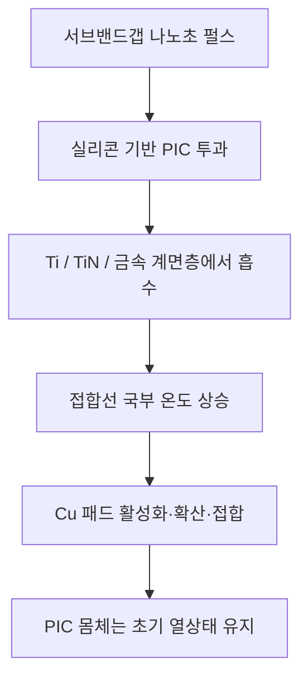

# 쿨스 CPO 무열접합

## PIC를 가열하지 않고 EIC와 PIC를 접합한다

> **종래 접합은 광자집적회로(PIC)를 가열한 뒤 발생한 파장 이동을 사후 보정합니다.**  
> **쿨스는 금속 접합계면만 선택적으로 가열하여 파장 이동 자체를 처음부터 방지합니다.**

[English](README.md) · [中文](README_ZH.md)

## 핵심 명제

공동패키지광학(Co-Packaged Optics, CPO)은 광자집적회로(Photonic Integrated Circuit, PIC)를 전자집적회로(Electronic Integrated Circuit, EIC) 및 스위치 ASIC·XPU 가까이에 배치합니다. PIC에는 변조기, 검출기, 공진기, 도파로 및 레이저가 포함되고, EIC에는 드라이버, 트랜스임피던스 증폭기(Transimpedance Amplifier, TIA), 제어회로와 고속 전기 인터페이스가 포함됩니다.

따라서 EIC–PIC 접합은 일반적인 칩 간 접합이 아닙니다. 접합 과정에서 전체 조립체가 가열되면 PIC의 열광학 굴절률, 잔류응력, 패키지 변형과 공진조건이 바뀌어 파장이 이동할 수 있습니다. 업계는 이후 트리밍, 마이크로히터, 열전냉각기(Thermoelectric Cooler, TEC), 보정 테이블과 능동제어로 이를 복구합니다.

**쿨스는 순서를 바꿉니다. PIC를 먼저 가열한 뒤 보정하지 않고, 처음부터 접합계면만 가열하여 광학상태를 보존합니다.**

## 종래 접합의 열부담


대표적인 Cu–Cu 또는 Cu 기반 하이브리드 접합은 접합체 전체에 상당한 열예산을 부여합니다. 광소자에서는 조립 공정 자체가 파장 드리프트의 원인이 됩니다.

## 쿨스 서브밴드갭 무열접합 원리

반도체 몸체의 흡수단보다 낮은 에너지의 서브밴드갭 펄스는 PIC를 통과하며 몸체 내부에서는 거의 흡수되지 않습니다. 대신 EIC–PIC 구리 패드와 결합된 금속 계면층이 이 빛을 선택적으로 흡수하여 접합선에서 직접 열로 전환합니다.

실리콘 기반 PIC를 대표예로 하면 약 1.5 µm급 근적외선 나노초 펄스를 사용할 수 있습니다. 실리콘은 광투과 경로가 되고, Cu 패드의 접착층·배리어층·패시베이션층 또는 별도 선택흡수층이 광에너지를 접합열로 바꿉니다.

대표적인 선택흡수 계면은 다음 재료 또는 다층막으로 구현할 수 있습니다.

- 구리 패드와 결합된 티타늄(Titanium, Ti) 또는 질화티타늄(Titanium Nitride, TiN)
- 크롬(Chromium, Cr), 니켈(Nickel, Ni), 탄탈럼(Tantalum, Ta) 또는 관련 금속 스택
- 금속질화물, 금속산화물 또는 설계된 나노박막
- Cu 패드 사이·주변·하부에 배치한 별도 광흡수층
- 선택 파장과 펄스폭에 정합된 다층 흡수구조

공개 기술은 하나의 흡수재료나 단일 파장에 한정되지 않습니다. 본질은 다음과 같습니다.

> **인가된 서브밴드갭 펄스를 투과시키는 반도체 몸체와, 그 펄스를 선택적으로 흡수하여 접합열로 바꾸는 금속 접합계면을 결합한다.**

## 접합계면 선택 가열



대표 적층은 다음과 같습니다.

```text
EIC — 드라이버 / TIA / 제어회로
--------------------------------
Cu 패드 + 선택흡수·배리어·패시베이션 계면층
--------------------------------
Cu 패드
--------------------------------
PIC — 실리콘 포토닉스 / 광소자층

서브밴드갭 펄스는 PIC 측에서 입사하고,
반도체 몸체를 통과한 뒤,
금속 접합계면에만 에너지를 전달한다.
```

## 나노초 펄스가 중요한 이유

목표는 단순히 가열로를 레이저로 바꾸는 것이 아닙니다. 펄스 지속시간과 에너지 국소화가 열사건 자체를 바꿉니다.

- 접합계면은 활성화 또는 금속학적 접합에 필요한 온도에 도달합니다.
- 가열 체적은 패드와 나노미터~마이크로미터급 계면영역으로 제한됩니다.
- 짧은 펄스는 광소자 몸체로의 수직·수평 열확산을 억제합니다.
- 반복률, 스캔경로, 펄스 중첩률과 플루언스를 패드 크기 및 계면 열저항에 맞출 수 있습니다.
- 전체 다이를 가열하지 않고 선택된 패드 필드만 주소 지정할 수 있습니다.

설계 목표는 **접합계면 온도는 크게 상승시키되 PIC 몸체 온도상승은 무시 가능한 수준으로 제한하는 것**입니다.

## 보정에서 예방으로

```text
종래 방식
전체 열접합
→ PIC 광학상태 이동
→ 이동량 측정
→ 히터 / TEC / 트리밍 / 제어로 보정

쿨스 방식
서브밴드갭 펄스를 PIC에 투과
→ 금속 접합계면만 가열
→ EIC와 PIC 접합
→ 접합 전 광학상태 보존
→ 접합공정 유발 보정 제거
```

차이는 명확합니다.

쿨스는 모든 CPO 시스템이 운전 중 열제어를 전혀 필요로 하지 않는다고 주장하지 않습니다. 레이저, 공진기, 변조기와 ASIC은 운전 중 열을 발생시킵니다. 쿨스의 주장은 더 구체적이고 직접적입니다.

> **접합 공정 자체가 파장 이동, 잔류 열손상과 사후 캘리브레이션 부담을 만들 필요가 없다.**

## CPO에서의 기대효과

| 항목 | 종래 전체 열접합 | 쿨스 서브밴드갭 계면접합 |
|---|---|---|
| 가열영역 | EIC, PIC 및 주변 스택 | 금속 접합선과 패드 근방 |
| PIC 몸체 온도상승 | 큼 | 사실상 0에 가까운 설계목표 |
| 접합 유발 파장 이동 | 측정 후 보정 필요 | 원인 단계에서 방지 |
| 접합 후 광학 트리밍 | 빈번히 필요 | 접합 유발 트리밍 제거 목표 |
| 마이크로히터·TEC 부담 | 조립 드리프트까지 포함 | 운전열 제어에만 사용 가능 |
| 정렬상태 | 전체 열팽창에 노출 | 국부 가열 중 유지 |
| 열예산 | 웨이퍼·다이 전체 | 패드 선택적 |
| CPO 확장성 | 광소자의 접합열 민감성에 제한 | 고밀도 이종집적에 적합 |

## 대표 공정 순서

1. PIC와 EIC에 정렬 가능한 Cu 또는 Cu 기반 접합패드를 형성합니다.
2. 목표 접합면에 파장선택 계면층을 형성하거나 기존 배리어·패시베이션층을 이용합니다.
3. EIC와 PIC를 정렬하고 기계적 예압을 인가합니다.
4. 투명 반도체 측에서 서브밴드갭 나노초 펄스를 조사합니다.
5. PIC 몸체는 초기온도 부근에 유지하면서 금속계면만 선택적으로 가열합니다.
6. 선택된 스택에 따라 계면 활성화, 확산, 연화, 소결 또는 금속학적 접합을 유도합니다.
7. 계면 응고 또는 접합 안정화 후 하중을 해제합니다.
8. 별도의 열회복 공정 없이 전기연속성, 접합강도, 광파장, 삽입손실과 공진위치를 확인합니다.

## 적용 가능한 접합형태

- Cu–Cu 직접접합
- Cu와 Ti, TiN, Ta, TaN, Cr, Ni 등의 배리어·접착층 조합
- 금속 보조 하이브리드 본딩
- 마이크로범프 또는 저체적 솔더계면 활성화
- 금속 나노입자·소결 계면
- 패드 선택 열압착접합
- 다이-투-다이, 다이-투-웨이퍼 및 웨이퍼-투-웨이퍼 EIC–PIC 집적
- 적절한 광투과 경로와 선택흡수층을 설계할 수 있는 실리콘 포토닉스, InP 포토닉스, SiN 포토닉스 및 혼합재료 광엔진

## 검증 프로그램

결정적인 평가는 단순히 패드가 붙는지 여부가 아닙니다. 접합은 성립하면서 광소자 몸체가 변하지 않았음을 입증해야 합니다.

권장 검증축은 다음과 같습니다.

1. **계면온도:** 접합선의 과도온도 또는 상변화 기준물질 측정
2. **PIC 몸체온도:** 공진기, 변조기 또는 레이저 인접부의 시간분해 온도측정
3. **접합건전성:** 전단·인장·데이지체인저항·보이드·열사이클 평가
4. **광학상태 보존:** 접합 전후 공진파장, 레이저파장, 삽입손실, 소광비와 검출응답 비교
5. **보정부담:** 트리밍량, 히터전력, TEC 부하와 캘리브레이션 시간 비교
6. **선택성:** 접합계면 에너지흡수량 대비 반도체 몸체 흡수량
7. **확장성:** 패드 피치, 스캔속도, 펄스 중첩, 필드 크기 및 다중다이 처리량

핵심 합격기준은 다음입니다.

> **전기·기계 접합은 합격하면서 PIC의 광전달함수는 접합 유발 보정 없이 접합 전 허용범위 안에 유지되어야 한다.**

## CPO에서의 전략적 의미

CPO는 흔히 광소자 배치 문제 또는 정렬 문제로만 설명됩니다. 그러나 EIC–PIC 접합은 열순서 문제이기도 합니다.

대역폭과 에너지효율을 위해 EIC를 PIC 가까이에 배치해야 하지만, 종래 접합열은 통합하려는 광소자 자체를 변화시킵니다. 쿨스는 두 사건을 분리합니다.

- 반도체 몸체는 광투과 경로로 사용하고
- 금속 접합계면만 열반응 영역으로 사용합니다.

따라서 EIC–PIC 조립은 **전체 열공정**에서 **파장선택·공간선택 계면공정**으로 전환됩니다.

## 최종 주장

> **서브밴드갭 나노초 펄스는 광반도체 몸체를 통과하고 구리 접합패드와 결합된 금속층만 선택적으로 가열합니다. PIC 전체를 가열하지 않고 EIC와 PIC를 접합하므로, 접합 유발 성능저하와 사후 광학보정은 복구되는 것이 아니라 처음부터 방지됩니다.**

## 지식재산권 및 협상 가능 형태

본 저장소에 설명된 기술과 아키텍처는 쿨스의 특허출원, 관련 특허권 및 비공개 공정 노하우로 보호됩니다.

쿨스는 적격 전략 파트너와 구조화된 협의를 진행할 수 있습니다. 적용분야, 지역, 범위와 사업목적에 따라 다음 방식이 포함될 수 있습니다.

- 독점 또는 비독점 특허 라이선스
- 적용분야·지역 한정 권리
- 기술 및 공정 아키텍처 이전
- 공동개발 및 공동사업화
- 파운드리·OSAT·CPO 플랫폼 또는 장비 로드맵 통합
- 전략적 투자 또는 관련 기술사업 양수도
- 상업적 조건이 적합한 경우 관련 특허출원과 특허권 자체의 양도·이전

**협상은 라이선스에만 한정되지 않습니다. 거래목적과 조건이 적합하면 관련 특허 포트폴리오 자체도 거래에 포함될 수 있습니다.**

## 관련 쿨스 기술

- [쿨스 CoWoS 무워피지 / 대면적 서멀클러치](https://github.com/jhcho9494/Cools_CoWos_No_WarpageSolution)
- [쿨스 HBM 서멀클러치](https://github.com/jhcho9494/Cools_HBM_Thermal_Clutch)
- [쿨비아 글라스 금속화](https://github.com/jhcho9494/Cools_CoolVia_Glass_Metallization)
- [쿨스 DPP 서멀클러치 EUV](https://github.com/jhcho9494/Cools_DPP_Thermal_Clutch_EUV)

## 문의

**조진현 박사 — ㈜쿨스 대표**  
이메일: [jhcho@cools.co.kr](mailto:jhcho@cools.co.kr)

기술검토, 특허 라이선스, 공동개발, 장비 통합, 투자 또는 인수협의는 ㈜쿨스로 연락해 주십시오.

## 권리 고지

본 저장소는 기술 아키텍처와 접합공정 제안을 공개합니다. 대표 파장, 펄스조건, 재료, 적층 및 성능값은 설계 실시예와 검증목표이며 기술범위를 한정하지 않습니다.

본 공개는 어떠한 제안, 라이선스, 권리포기 또는 기술 실시허락도 의미하지 않습니다. 실제 거래는 기술·법률 실사와 최종 서면계약을 전제로 합니다.

© 2026 Cools Inc. All rights reserved.
