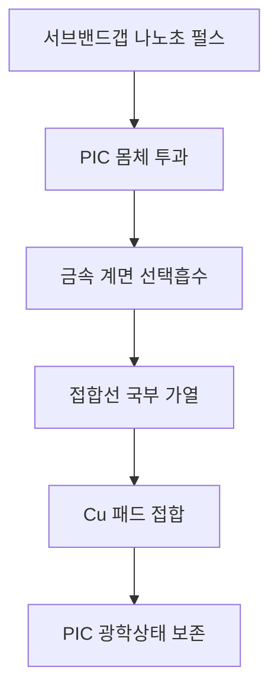

# 쿨스 CPO 무열예산 접합

## CPO의 운전열을 제어하는 기술이 아니라, 조립열이 광소자를 바꾸지 못하게 하는 접합 기술입니다

> **종래 접합은 EIC와 PIC 전체를 가열한 뒤 발생한 파장 이동을 사후 보정합니다.**  
> **쿨스는 금속 접합계면만 선택적으로 가열하여 접합공정 유발 파장 이동을 처음부터 방지합니다.**

[English](README.md) · [中文](README_ZH.md)

## 1. TOPS가 중요한 CPO에서 왜 ‘조립열’까지 제거해야 하는가

공동패키지광학(Co-Packaged Optics, CPO)은 광자집적회로(PIC), 전자집적회로(EIC) 및 스위치 ASIC·XPU를 가까이 배치하여 고속 전기구간을 줄이고 다수의 광파장 채널을 집적합니다. PIC 내부의 열광학 위상 천이기(TOPS)는 링 공진기, 파장 필터, 간섭계 및 광스위치의 위상과 광경로를 설정합니다.

TOPS는 운전 중 의도적으로 열을 사용하지만, 이것이 조립공정에서 PIC 전체를 가열해도 된다는 뜻은 아닙니다.

- **TOPS 열:** 제어 가능한 위치·시간·온도에서 광상태를 설정하기 위한 기능열
- **접합 열:** PIC 전체의 굴절률, 잔류응력, 정렬 및 공진조건을 비의도적으로 바꾸는 공정열

접합과정에서 생긴 파장 이동은 TOPS의 가용 조정범위와 전력을 소모하고, 마이크로히터·TEC·트리밍·보정테이블에 영구적인 추가 부담을 남깁니다. 파장 채널 수가 늘어날수록 이러한 오프셋 보정은 채널별 전력과 캘리브레이션 복잡도로 확대됩니다.

쿨스의 핵심 명제는 명확합니다.

> **TOPS는 운전 중 필요한 광스위칭에만 사용하고, 접합공정이 만든 불필요한 파장 오차를 평생 보정하는 데 사용하지 않는다.**

---

## 2. 종래 전체 열접합의 연쇄부담


EIC–PIC 접합에서 전체 다이 또는 웨이퍼에 열예산을 부여하면 광소자 몸체와 패키지 적층이 함께 팽창하고 냉각됩니다. 그 결과 접합 후 공진파장, 삽입손실, 정렬상태 및 잔류응력이 접합 전 상태에서 벗어날 수 있습니다. CPO에서는 이것이 단순 수율 문제가 아니라 다채널 광엔진의 초기 보정량과 지속 운전전력을 증가시키는 원인이 됩니다.

---

## 3. 서브밴드갭 계면선택 접합 원리

반도체 흡수단보다 낮은 에너지의 펄스를 광반도체 몸체를 통해 전달하고, Cu 패드와 결합된 금속 계면층에서 선택적으로 흡수시킵니다. 광반도체 몸체는 광투과 경로가 되고, 금속 접합계면만 열반응 영역이 됩니다.



대표적인 선택흡수·계면 구조는 Ti, TiN, Ta, TaN, Cr, Ni, 금속질화물, 금속산화물, 나노박막 또는 파장정합 다층막을 포함할 수 있습니다. 특정 파장이나 흡수재료 하나가 본질은 아닙니다.

> **본질은 반도체 몸체가 투과시키는 광에너지를 금속 접합계면이 선택적으로 흡수하여, 접합에 필요한 열사건을 패드 근방에만 만드는 것입니다.**

---

## 4. 대표 적층과 공정

```text
EIC — 드라이버 / TIA / 제어회로
--------------------------------
Cu 패드 + 선택흡수·배리어 계면층
--------------------------------  ← 국부 접합열
Cu 패드
--------------------------------
PIC — 도파로 / 공진기 / TOPS / 광소자층

펄스는 투명 반도체 측에서 입사하여 PIC 몸체를 통과하고,
금속 접합계면에서만 접합에너지로 전환된다.
```

대표 공정은 다음과 같습니다.

1. PIC와 EIC에 정렬 가능한 Cu 또는 Cu 기반 접합패드를 형성합니다.
2. 접합면에 선택흡수 계면층을 형성하거나 기존 배리어·패시베이션층을 이용합니다.
3. EIC와 PIC를 정렬하고 예압합니다.
4. 투명 반도체 측에서 서브밴드갭 나노초 펄스를 조사합니다.
5. 금속계면을 선택적으로 활성화·확산·연화·소결 또는 접합합니다.
6. PIC 몸체의 광학상태를 보존한 채 계면을 안정화합니다.
7. 별도 열회복 없이 접합강도, 전기연속성 및 광전달함수를 확인합니다.

---

## 5. CPO 대역폭과 소비전력에 미치는 영향

본 기술이 데이터 대역폭을 직접 생성하는 것은 아닙니다. 대신 접합공정이 광채널에 부과하는 초기 오프셋과 보정전력을 제거하여, 설계된 광대역폭을 실제 패키지에서 보존합니다.

| 접합 유발 문제 | CPO 영향 | 무열예산 접합의 목표 |
|---|---|---|
| 공진파장 이동 | WDM 채널 정렬 불량·가용 채널 축소 | 접합 전 공진조건 보존 |
| 광정렬·응력 변화 | 삽입손실 증가·링크 마진 감소 | 전체 열팽창 억제 |
| 채널별 초기 오프셋 | TOPS 조정범위와 정적전력 소모 | TOPS를 본래 스위칭·운전보정에 사용 |
| 접합 후 트리밍 | 제조시간·공정복잡도 증가 | 접합 유발 트리밍 제거 |
| TEC·제어 부담 | 광엔진 간접전력 증가 | 운전열 제어에 냉각능력 집중 |

따라서 기대효과는 **대역폭을 새로 만드는 것**이 아니라 **접합 후에도 설계된 파장채널, 링크마진 및 TOPS 가용범위를 훼손하지 않는 것**입니다.

---

## 6. 두 Cools 저장소의 기술 경계

| 구분 | 본 저장소: CPO Zero-Thermal-Budget Bonding | Thermally Active Photonic Substrate 저장소 |
|---|---|---|
| 해결 시점 | 제조·조립 중 | CPO 운전 중 |
| 핵심 대상 | EIC–PIC 금속 접합계면 | BOX, TOPS 하부 열경로, 고열전도 핸들러 |
| 핵심 문제 | 접합열에 의한 파장·응력·정렬 변화 | TOPS의 고정 열저항, 느린 리셋, 열누화, 유지전력 |
| 핵심 수단 | 반도체 투과 펄스와 금속계면 선택흡수 | 영역별 알루미나 BOX와 마이크로 서멀클러치 |
| 기술 결과 | 접합공정 유발 보정 제거 | 운전 중 광스위칭 속도·전력·열안정성 개선 |

본 저장소는 **접합 순간의 열예산을 패드계면으로 제한하는 제조공정 기술**입니다. [열능동 광자기판](https://github.com/jhcho9494/Cools_Thermally_Active_Photonic_Substrate)은 완성된 광엔진에서 TOPS의 열을 상태별로 가두고 방출하는 **운전 아키텍처**입니다.

두 기술을 결합하면 다음과 같은 일관된 CPO 열전략이 형성됩니다.

```text
조립 단계: PIC에 불필요한 열이력을 남기지 않음
    ↓
운전 단계: TOPS에 필요한 열만 국부적으로 생성·유지·방출
    ↓
결과: 접합보정 전력과 운전 열제어 전력을 서로 분리하여 최소화
```

---

## 7. 핵심 구조도 설명 문구

### 그림 1. TOPS 기능열과 접합 공정열의 구분

> **TOPS 기능열은 광경로와 공진조건을 설정하기 위해 국부적으로 제어되는 열이다. 반면 전체 접합열은 PIC 전역의 굴절률·응력·정렬을 바꾸는 비의도적 열이력이다. 쿨스 무열예산 접합은 후자만 제거한다.**

### 그림 2. 계면선택 광열접합

> **서브밴드갭 펄스는 PIC 몸체를 투과하고 Cu 패드에 결합된 선택흡수층에서 열로 전환된다. 접합온도는 금속계면에 형성되지만 광소자 몸체는 접합 전 열상태를 유지한다.**

### 그림 3. CPO 전력부담의 예방

> **전체 열접합은 공진파장 오프셋을 만들고, 그 오프셋은 채널별 TOPS·TEC·트리밍 부담으로 이어진다. 계면선택 접합은 이 보정사슬의 원인을 조립단계에서 차단한다.**

### 그림 4. 두 기술의 결합

> **무열예산 접합은 제조 중 PIC의 광학기준점을 보존하고, 열능동 광자기판의 마이크로 서멀클러치는 운전 중 TOPS 열경로를 전환한다. 하나는 조립열을 제거하고, 다른 하나는 기능열을 제어한다.**

---

## 8. 검증 기준

핵심 합격기준은 단순히 패드가 붙는 것이 아닙니다.

> **전기·기계 접합은 합격하면서 PIC의 공진파장, 삽입손실 및 광전달함수가 접합 유발 보정 없이 접합 전 허용범위 안에 유지되어야 합니다.**

검증항목은 계면 과도온도, PIC 몸체온도, 접합강도, 데이지체인 저항, 보이드, 열사이클, 접합 전후 공진파장·삽입손실·소광비, 트리밍량, TOPS 초기 보정전력 및 TEC 부하를 포함합니다.

---

## 9. 적용 가능한 접합형태

- Cu–Cu 직접접합 및 금속 보조 하이브리드 본딩
- Cu/Ti, Cu/TiN, Cu/Ta, Cu/TaN, Cu/Cr 또는 Cu/Ni 계면
- 마이크로범프·저체적 솔더·금속 나노입자 소결계면
- 다이-투-다이, 다이-투-웨이퍼 및 웨이퍼-투-웨이퍼 집적
- 실리콘, InP, SiN 및 혼합재료 광엔진

---

## 10. 지식재산권 및 문의

본 저장소는 특허출원과 관련 권리에 기초한 기술 아키텍처를 공개합니다. 대표 파장, 펄스조건, 재료, 적층 및 성능값은 설계 실시예와 검증목표이며 기술범위를 한정하지 않습니다. 실제 구현에 필요한 세부 공정창, 표면상태, 펄스 운전조건 및 제조 노하우 전체를 공개하지 않습니다.

**조진현 박사 — ㈜쿨스 대표**  
이메일: [jhcho@cools.co.kr](mailto:jhcho@cools.co.kr)

기술검토, 특허 라이선스, 공동개발, CPO·파운드리·OSAT·장비 통합 및 사업협의를 환영합니다.

© 2026 Cools Inc. All rights reserved.
