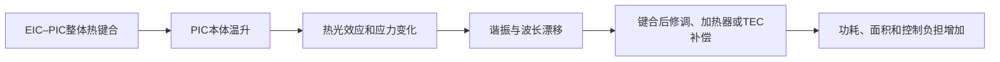
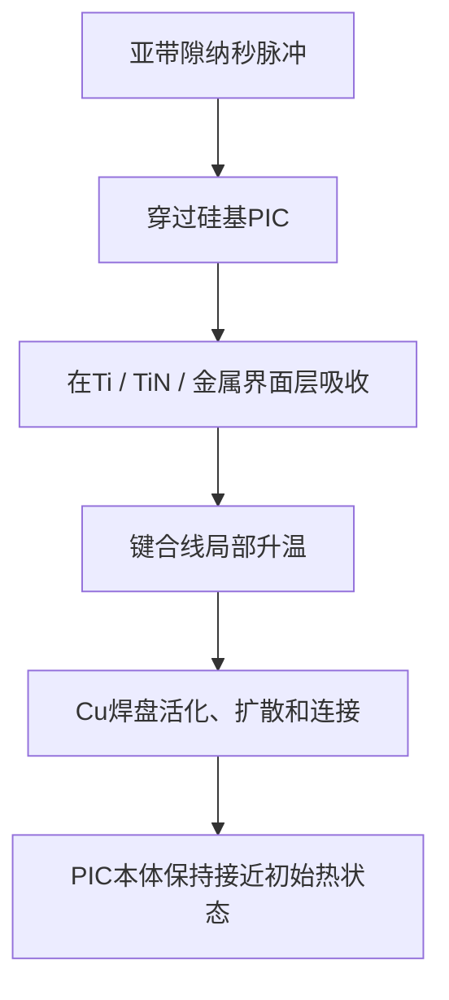

# Cools CPO 零热预算键合

## 在不加热光子芯片本体的情况下键合 EIC 与 PIC

> **传统键合先加热光子集成电路（PIC），再补偿由此产生的波长漂移。**  
> **Cools 只选择性加热金属键合界面，从源头防止漂移。**

[English](README.md) · [한국어](README_KR.md)

## 核心主张

共同封装光学（Co-Packaged Optics，CPO）把光子集成电路（Photonic Integrated Circuit，PIC）放置在电子集成电路（Electronic Integrated Circuit，EIC）、交换 ASIC 或 XPU 附近。PIC 包含调制器、探测器、谐振器、波导和激光器；EIC 包含驱动器、跨阻放大器（Transimpedance Amplifier，TIA）、控制电路和高速电接口。

因此，EIC–PIC 键合并不是普通芯片间连接。若在键合过程中加热整个组件，PIC 的热光折射率、残余应力、封装应变和谐振条件可能发生变化，引起波长漂移。行业通常在键合后通过修调、微加热器、热电制冷器（Thermoelectric Cooler，TEC）、校准表和主动控制来补偿。

**Cools 改变这一顺序：不再先加热 PIC 再修正，而是从一开始只加热键合界面，保留原始光学状态。**

## 传统键合的热负担



代表性的 Cu–Cu 或 Cu 基混合键合会给整个晶圆或芯片堆叠施加较高热预算。对于光子器件，装配工序本身由此成为光学漂移源。

## Cools 亚带隙零热预算键合原理

能量低于半导体吸收边的亚带隙脉冲可穿过 PIC，而在半导体本体中仅产生很低吸收。光能随后被与 EIC–PIC 铜焊盘相关的金属界面层选择性吸收，并直接在键合线转化为热量。

以硅光子 PIC 为代表，可使用约 1.5 µm 波段的近红外纳秒脉冲。硅本体作为光传输窗口，Cu 焊盘上的粘附层、扩散阻挡层、钝化层或专用吸收层把光能转换为局部键合热。

代表性选择吸收界面可由下列材料或多层结构构成：

- 与铜焊盘结合的钛（Titanium，Ti）或氮化钛（Titanium Nitride，TiN）；
- 铬（Chromium，Cr）、镍（Nickel，Ni）、钽（Tantalum，Ta）及相关金属堆叠；
- 金属氮化物、金属氧化物或工程化纳米层；
- 位于 Cu 焊盘之间、周围或下方的专用光吸收层；
- 与所选波长、脉宽和能量密度匹配的多层吸收结构。

公开概念不限定于单一吸收材料或单一波长。其本质是：

> **将可透过亚带隙脉冲的半导体本体，与能够选择性吸收该脉冲并转化为局部键合热的金属界面结合。**

## 选择性界面加热



代表性堆叠如下：

```text
EIC — 驱动器 / TIA / 控制电路
--------------------------------
Cu焊盘 + 选择吸收 / 阻挡 / 钝化界面层
--------------------------------
Cu焊盘
--------------------------------
PIC — 硅光子 / 光学器件层

亚带隙脉冲从 PIC 一侧入射，
穿过半导体本体，
仅在金属键合界面沉积能量。
```

## 纳秒脉冲为何重要

目标并不只是用激光代替加热炉。脉冲持续时间和能量局域化改变了热事件本身。

- 键合界面达到活化、扩散、烧结或冶金连接所需温度；
- 加热体积限制在焊盘及纳米到微米尺度界面区域；
- 短脉冲抑制热量向光子器件本体横向和纵向扩散；
- 重复频率、扫描路径、脉冲重叠率和能量密度可与焊盘尺寸和界面热阻匹配；
- 仅对选定焊盘阵列进行寻址，而无需加热整颗 EIC–PIC 组件。

设计目标是实现**键合界面显著升温，而 PIC 本体温升接近可忽略水平**。

## 从补偿转向预防

```text
传统方式
整体热键合
→ PIC光学状态改变
→ 测量漂移
→ 用加热器 / TEC / 修调 / 控制补偿

Cools方式
亚带隙脉冲穿过PIC
→ 只加热金属键合界面
→ 键合EIC与PIC
→ 保持键合前光学状态
→ 消除由键合工序引起的后续补偿
```

Cools 并不声称所有 CPO 系统在运行中永远不需要任何热控制。激光器、谐振器、调制器和 ASIC 在运行时仍会产生热量。Cools 的主张更具体：

> **键合工序本身不必制造波长漂移、残余热损伤和后续校准负担。**

## 对 CPO 的预期优势

| 项目 | 传统整体热键合 | Cools 亚带隙界面键合 |
|---|---|---|
| 加热区域 | EIC、PIC及周边堆叠 | 金属键合线和焊盘附近 |
| PIC本体温升 | 显著 | 接近零 / 可忽略的设计目标 |
| 键合引起的波长漂移 | 需测量后补偿 | 从源头预防 |
| 键合后光学修调 | 经常需要 | 目标是消除键合引起的修调 |
| 微加热器 / TEC负担 | 同时承担装配漂移 | 可只用于运行热控制 |
| 对准状态 | 暴露于整体热膨胀 | 局部加热时保持 |
| 热预算 | 晶圆级或芯片级 | 焊盘选择性 |
| CPO扩展性 | 受光子器件对装配热敏感性限制 | 适合高密度异质集成 |

## 代表性工艺流程

1. 在 PIC 和 EIC 上形成可对准的 Cu 或 Cu 基键合焊盘。
2. 在目标连接表面形成波长选择界面层，或利用现有阻挡/钝化层。
3. 对准 EIC 与 PIC 并施加机械预载。
4. 从透明半导体一侧照射亚带隙纳秒脉冲。
5. 保持 PIC 本体接近初始温度，仅选择性加热金属界面。
6. 根据所选材料体系，实现界面活化、扩散、软化、烧结或冶金连接。
7. 在界面凝固或键合稳定后解除载荷。
8. 无需额外热恢复步骤，验证电连续性、键合强度、光学波长、插入损耗和谐振位置。

## 可适用的连接模式

- Cu–Cu 直接键合；
- Cu 与 Ti、TiN、Ta、TaN、Cr、Ni 等阻挡/粘附层组合；
- 金属辅助混合键合；
- 微凸点或低体积焊料界面活化；
- 金属纳米颗粒或烧结界面；
- 焊盘选择性热压键合；
- 芯片到芯片、芯片到晶圆和晶圆到晶圆 EIC–PIC 集成；
- 可设计透明光路与选择吸收界面的硅光子、InP 光子、SiN 光子及混合材料光引擎。

## 验证计划

决定性评价不只是焊盘是否连接，而是必须证明在连接形成的同时，光学器件本体没有被改变。

建议验证项目包括：

1. **界面温度：** 键合线瞬态温度或校准相变指标；
2. **PIC本体温度：** 谐振器、调制器或激光器附近的时间分辨温度；
3. **键合完整性：** 剪切、拉伸、菊花链电阻、空洞和热循环；
4. **光学状态保持：** 键合前后谐振波长、激光波长、插入损耗、消光比和探测响应；
5. **补偿负担：** 修调量、微加热器功率、TEC负载和校准时间；
6. **选择性：** 键合界面能量沉积相对于半导体本体吸收的比例；
7. **可扩展性：** 焊盘间距、扫描速度、脉冲重叠、场尺寸和多芯片吞吐量。

核心合格目标为：

> **电气和机械键合通过，同时 PIC 的光学传输函数在无需键合引起的后续补偿情况下保持在键合前容差范围内。**

## 对 CPO 的战略意义

CPO 常被描述为光学放置或对准问题，但 EIC–PIC 连接同样是热时序问题。

为了带宽和能效，EIC 必须靠近 PIC；但传统连接热会改变正在集成的光学器件。Cools 将这两个事件分离：

- 半导体本体作为光传输路径；
- 金属键合界面单独作为热反应区。

因此，EIC–PIC 装配从**整体热工艺**转变为**波长选择与空间选择的界面工艺**。

## 最终主张

> **亚带隙纳秒脉冲穿过光子半导体本体，只选择性加热与铜键合焊盘结合的金属层。EIC 与 PIC 在不整体加热 PIC 的情况下完成连接，因此由键合引起的性能下降和后续光学校正不是事后修复，而是从一开始被避免。**

## 知识产权与交易方式

本存储库所述技术和架构受 Cools Inc. 的专利申请、相关专利权及非公开工艺知识保护。

Cools 可与合格战略合作伙伴开展结构化讨论。根据应用领域、地区、范围和商业目的，可能的交易方式包括：

- 独占或非独占专利许可；
- 限定应用领域或地区的权利；
- 技术及工艺架构转让；
- 联合开发与商业化；
- 纳入晶圆代工、OSAT、CPO 平台或设备路线图；
- 战略投资或相关技术业务转让；
- 在商业条件合适时，相关专利申请和专利权本身的转让。

**谈判不局限于许可。在交易目的和条件适当时，相关专利组合本身也可纳入交易。**

## 相关 Cools 技术

- [Cools CoWoS 无翘曲 / 大面积热离合器](https://github.com/jhcho9494/Cools_CoWos_No_WarpageSolution)
- [Cools HBM 热离合器](https://github.com/jhcho9494/Cools_HBM_Thermal_Clutch)
- [Cools CoolVia 玻璃金属化](https://github.com/jhcho9494/Cools_CoolVia_Glass_Metallization)
- [Cools DPP 热离合器 EUV](https://github.com/jhcho9494/Cools_DPP_Thermal_Clutch_EUV)

## 联系方式

**Dr. Jinhyun Cho — Founder & CEO, Cools Inc.**  
电子邮箱：[jhcho@cools.co.kr](mailto:jhcho@cools.co.kr)

如需技术评审、专利许可、联合开发、设备集成、投资或收购讨论，请联系 Cools Inc.

## 权利声明

本存储库公开的是技术架构与键合工艺提案。代表性波长、脉冲条件、材料、堆叠和性能结果属于设计实施例与验证目标，并不限定技术范围。

本公开不构成任何要约、许可、权利放弃或实施授权。任何交易均以技术和法律尽职调查及最终书面协议为前提。

© 2026 Cools Inc. All rights reserved.
